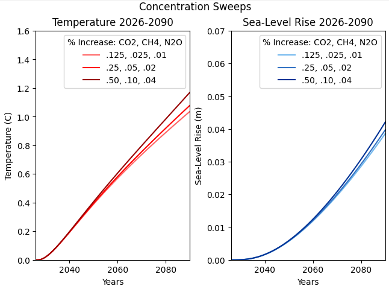
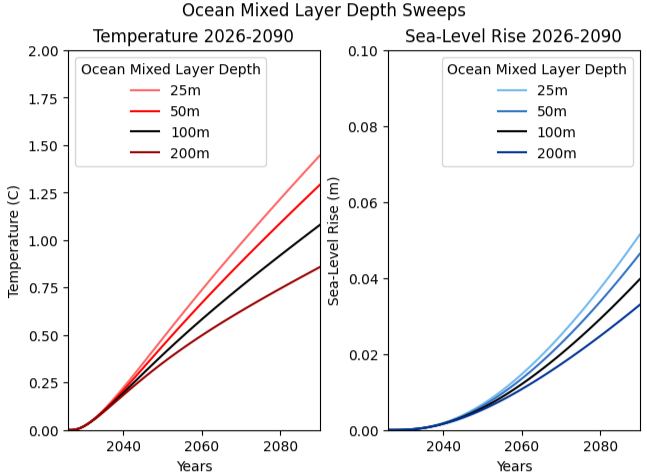

# pySCM

## Overview

This repository utilizes the pySCM (Python Simple Climate Model). The documentation for the model is listed below, as well as the GitHub repository for the model:

Documentation: https://pyscm.readthedocs.io/en/latest/code.html

GitHub Repository: https://github.com/bodekerscientific/pyscm

This repository makes use of pySCM and contains files for model output. Simple Python scripts to compute GHG emissions have also been created and are stored in this repository as well.

## Contents and Model Information

For full information on pySCM, see the documentation listed above. The model requires two input files (these are listed in the repository):

1. SimpleClimateModelParameterFile.txt
   - This file contains parameters needed to run the model itself, including start year, end year, years to evaluate the response              function, and ocean mixed layer depth in meters.
   - This file also contains information about the output scripts.
   - An example of this file can be seen listed under the file named "SimpleClimateModelParameterFile.txt".
   
2. EmissionsForSCM.txt
   - This file contains the emissions of the following greenhouse gases: CO2, CH4, N2O, and SOx for the chosen number of years                 specified in the "SimpleClimateModelParameterFile.txt" file.
   - An example of this file can be seen listed under the file named "EmissionsForSCM.txt".
  
The model returns the following 5 output files:

1. temp_output.txt
2. slr_output.txt
3. co2_output.txt
4. ch4_output.txt
5. n20_output.txt

Each file contains the raw results from the model run.

## Repository Scripts

This repository contains the following two scripts that have been created to run different experiments with pySCM:

1. GHG.py
   - IMPORTANT NOTE: This file operates under the assumption that the pySCM code has been modified to update the greenhouse gas                base values. In pySCM, the greenhouse gas base values are set to the pre-industrial level. This script assumes the user has changed       the greenhouse gas base values in the model code itself to modern-day (2025) values.
   - This script allows the user to pick an annual growth rate for each GHG (DEFAULTS: CO2 = 0.25%, CH4 = 0.05%, N2O = 0.02%), which then      compounds from the base for the given number of years.
   - The script also writes the resulting concentrations directly to the "EmissionsForSCM.txt" file.

2. pySCM_demo.py
   - This script contains code that actually runs pySCM.
   - The script saves the output data and also plots the temperature vs. years and Sea Level Rise vs. years.

## Output Example

### Concentration Example

This example uses a start year of 2026, an end year of 2090, a time to evaluate response functions of 125, and an ocean mixed layer depth of 100 meters. The parameters changed here include the annual growth rate parameter for CO2, CH4, and N2O. SOx is taken to be zero for this simulation. 

It is seen that higher annual growth rates of these greenhouse gases correlate with higher temperature output and higher slr output. This aligns with what is expected should the rates of greenhouse gases continue to increase.

### Ocean Mixed Layer Example

This example simulates the effect that the ocean mixed layer has on the temperature output and the slr output. The ocean mixed layer depth is the thickness of the top layer of the ocean. This experiment keeps all parameters constant and varies only the ocean mixed layer depth to understand its impact on climate and energy balance. This simulation uses a start year of 2026, an end year of 2090, and a years to evaluate response function of 125. The ocean mixed layer depth is varied: 25m -> 50m -> 100m -> 200m. The annual growth rate parameters are set to the default value, that is:

- CO2 = 0.25%
- CH4 = 0.05%
- N2O = 0.02%

Higher ocean mixed layer depths show lower temperature and slr output values. This is likely due to the fact that a larger ocean layer depth absorbs more heat and thus keeps the atmopsheric temperature lower.

## Further Ideas

1. Include SOx concentrations in the model simulations to examine the cooling rate effect.
2. Create an annual growth rate that flatlines by the year 2040, simulating net-zero carbon effects, and evaluate how that changes the temperature and slr output.
3. Compare output in this model to other standardized simple climate models, such as MAGICC or FaIR

## Packages

The packages needed to utilize the code in this repository are:

1. numpy
2. matplotlib
3. pandas
4. pySCM environment (use the call: from pySCM import SimpleClimateModel)

## Use

The code here is free and available to download, use, and can be modified any way. I do ask for an appropriate acknowledgement should it be used in any kind of project, publication, teaching material, etc.
   
